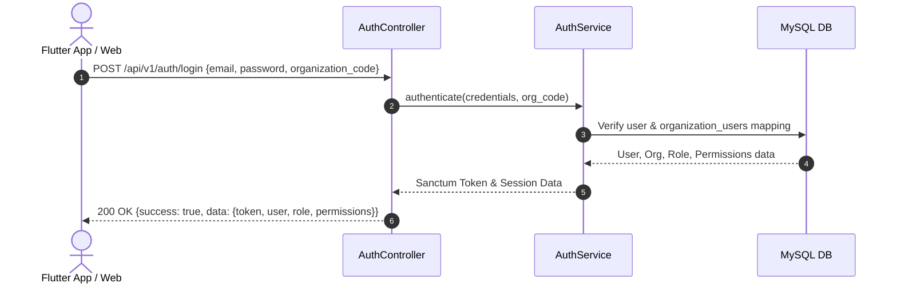
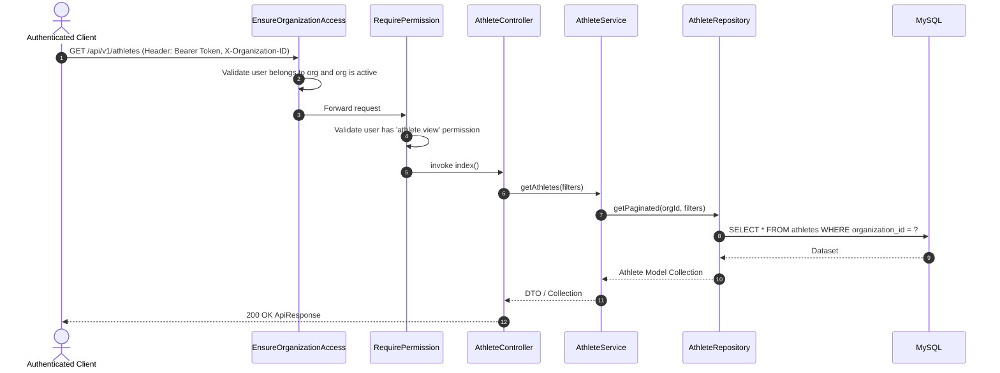
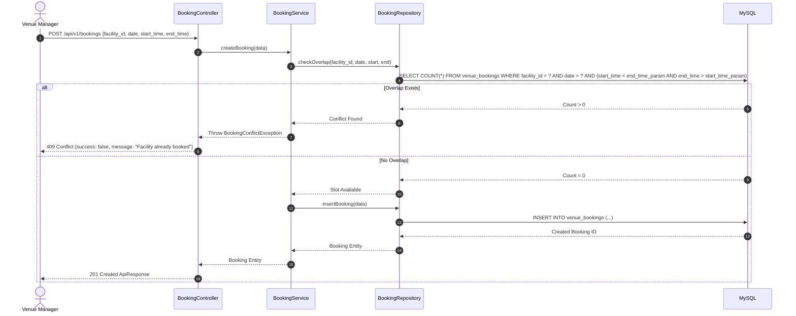

# Data Flow Diagrams — KhelSutra

## 1. Authentication & Tenant Scope Flow

```mermaid
sequenceDiagram
    autonumber
    actor Client as Flutter App / Web
    participant Auth as AuthController
    participant Service as AuthService
    participant DB as MySQL DB

    Client->>Auth: POST /api/v1/auth/login {email, password, organization_code}
    Auth->>Service: authenticate(credentials, org_code)
    Service->>DB: Verify user & organization_users mapping
    DB-->>Service: User, Org, Role, Permissions data
    Service-->>Auth: Sanctum Token & Session Data
    Auth-->>Client: 200 OK {success: true, data: {token, user, role, permissions}}
```

## 2. Tenant-Isolated Request Flow

```mermaid
sequenceDiagram
    autonumber
    actor Client as Authenticated Client
    participant MW as EnsureOrganizationAccess
    participant RBAC as RequirePermission
    participant Ctrl as AthleteController
    participant Svc as AthleteService
    participant Repo as AthleteRepository
    participant DB as MySQL

    Client->>MW: GET /api/v1/athletes (Header: Bearer Token, X-Organization-ID)
    MW->>MW: Validate user belongs to org and org is active
    MW->>RBAC: Forward request
    RBAC->>RBAC: Validate user has 'athlete.view' permission
    RBAC->>Ctrl: invoke index()
    Ctrl->>Svc: getAthletes(filters)
    Svc->>Repo: getPaginated(orgId, filters)
    Repo->>DB: SELECT * FROM athletes WHERE organization_id = ?
    DB-->>Repo: Dataset
    Repo-->>Svc: Athlete Model Collection
    Svc-->>Ctrl: DTO / Collection
    Ctrl-->>Client: 200 OK ApiResponse
```

## 3. Venue Booking Overlap Prevention Flow

```mermaid
sequenceDiagram
    autonumber
    actor User as Venue Manager
    participant Ctrl as BookingController
    participant Svc as BookingService
    participant Repo as BookingRepository
    participant DB as MySQL

    User->>Ctrl: POST /api/v1/bookings {facility_id, date, start_time, end_time}
    Ctrl->>Svc: createBooking(data)
    Svc->>Repo: checkOverlap(facility_id, date, start, end)
    Repo->>DB: SELECT COUNT(*) FROM venue_bookings WHERE facility_id = ? AND date = ? AND (start_time < end_time_param AND end_time > start_time_param)
    alt Overlap Exists
        DB-->>Repo: Count > 0
        Repo-->>Svc: Conflict Found
        Svc-->>Ctrl: Throw BookingConflictException
        Ctrl-->>User: 409 Conflict {success: false, message: "Facility already booked"}
    else No Overlap
        DB-->>Repo: Count = 0
        Repo-->>Svc: Slot Available
        Svc->>Repo: insertBooking(data)
        Repo->>DB: INSERT INTO venue_bookings (...)
        DB-->>Repo: Created Booking ID
        Repo-->>Svc: Booking Entity
        Svc-->>Ctrl: Booking Entity
        Ctrl-->>User: 201 Created ApiResponse
    end
```
