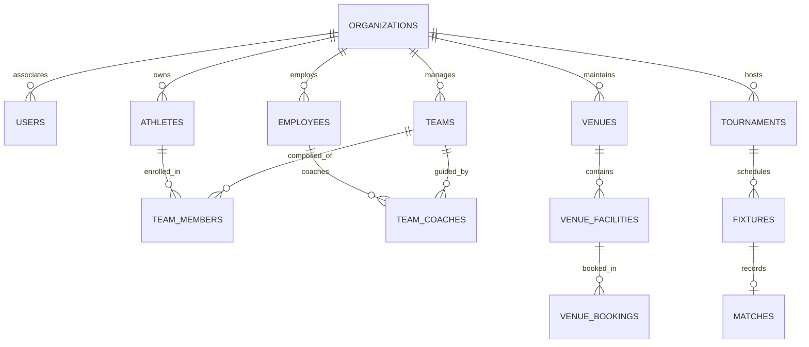

# Entity Relationship Diagram — KhelSutra

Please refer to the primary visual diagram at [`database/diagrams/er-diagram.mermaid`](file:///database/diagrams/er-diagram.mermaid) and domain explanations at [`database/diagrams/er-diagram.md`](file:///database/diagrams/er-diagram.md).

